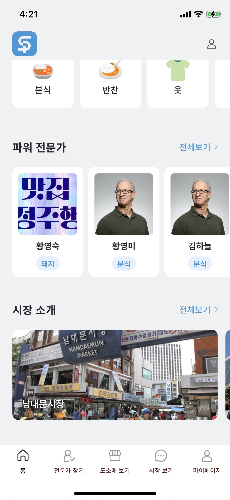
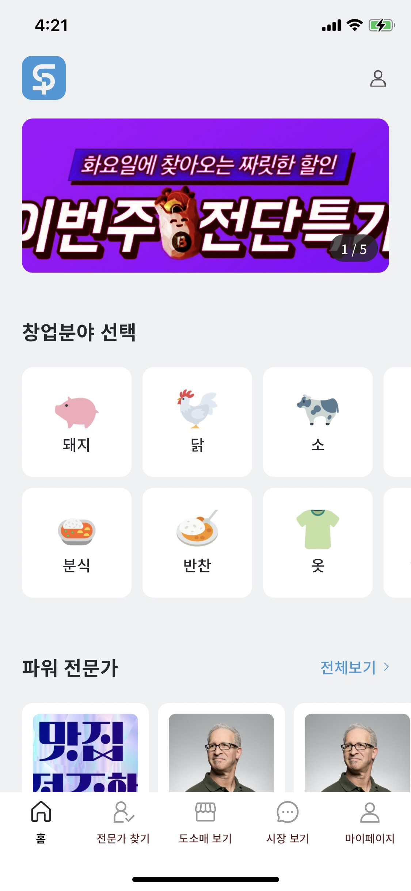
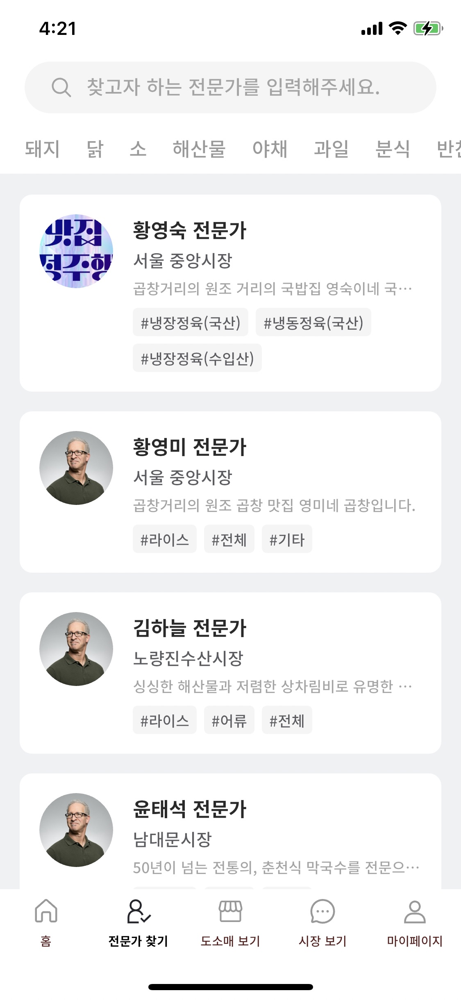
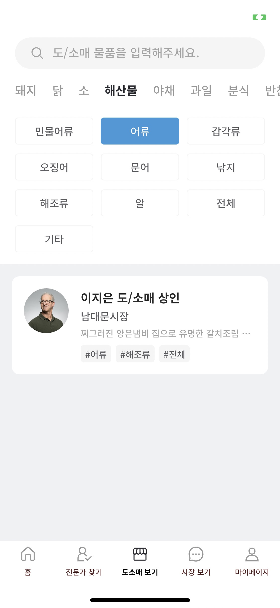
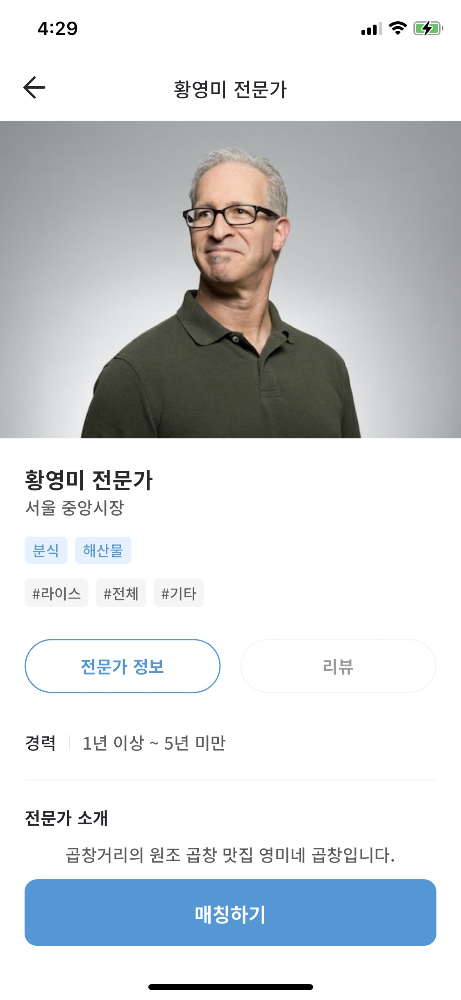
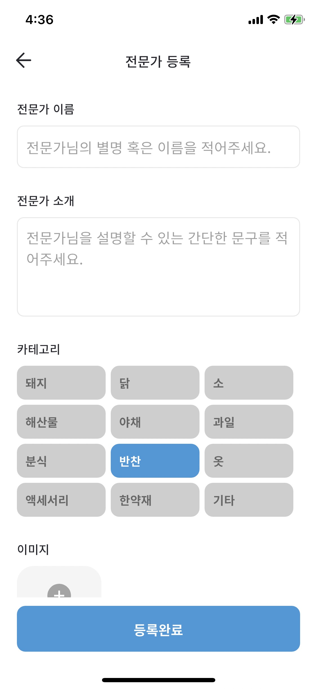
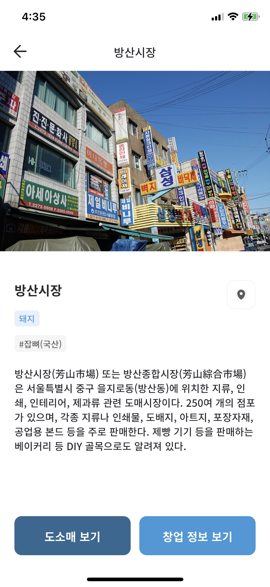

# 🏪 Market-Mate

<p align="center">
  
</p>

<p align="center">
  <b>AI-Powered Platform Connecting Traditional Market Vendors with Aspiring Entrepreneurs</b>
</p>

<p align="center">
  
  
  
  
  
</p>

<p align="center">
  
  
  
</p>

---

## 🎯 Overview

**Market-Mate** is an AI-powered mentorship and B2B wholesale platform that connects traditional Korean market vendors with aspiring food business entrepreneurs. The platform digitizes decades of industry expertise that exists only in traditional markets and makes it accessible through intelligent matching.

### 🏆 Key Achievements

| Metric | Result |
|--------|--------|
| **Government Funding** | $50,000+ (70M KRW) secured |
| **Patent Status** | Filed (#10-2023-0022550) |
| **Active Users** | 700+ (200 vendors, 500 entrepreneurs) |
| **Retention Rate** | 85% month-over-month |
| **Successful Matches** | 200+ mentor-mentee connections |

---

## 📋 Table of Contents

- [Problem & Solution](#-problem--solution)
- [Screenshots](#-screenshots)
- [Key Features](#-key-features)
- [Technical Architecture](#-technical-architecture)
- [Tech Stack](#-tech-stack)
- [Patent Information](#-patent-information)
- [Performance Metrics](#-performance-metrics)
- [Getting Started](#-getting-started)
- [Roadmap](#-roadmap)
- [Contact](#-contact)

---

## 💡 Problem & Solution

### The Problem

**Restaurant Startup Reality (Korea Statistics Bureau, 2022):**
- 1-year survival rate: **66.8%**
- 5-year survival rate: **24.4%**
- Primary failure reason: **"Lack of know-how and competitiveness"**

**Traditional Market Digital Transformation Challenges:**
- Elderly vendors struggle with app-based product registration
- Existing apps focus only on product sales, not knowledge transfer
- No structured mentorship system for aspiring entrepreneurs

### The Solution

Market-Mate provides a comprehensive ecosystem that:

| Existing Apps | Market-Mate |
|---------------|-------------|
| ❌ Product sales only | ✅ **Knowledge transfer** + wholesale connection |
| ❌ High IT barriers for elderly | ✅ **AI auto-registration** system |
| ❌ Simple product listing | ✅ **Intelligent mentor matching** |
| ❌ Many failed attempts | ✅ **New business model** |

### What Users Learn from Market Experts

```
#1 How to select quality ingredients
#2 Wholesale pricing and supplier connections
#3 Food preparation and storage techniques
#4 Equipment and material sourcing
#5 Regional business know-how
```

---

## 📱 Screenshots

### Home & Search

<p align="center">
  
  &nbsp;&nbsp;
  
</p>

<p align="center">
  <sub><b>Home Categories</b> &nbsp;&nbsp;&nbsp;&nbsp;&nbsp;&nbsp;&nbsp;&nbsp;&nbsp;&nbsp;&nbsp;&nbsp;&nbsp;&nbsp;&nbsp;&nbsp;&nbsp;&nbsp;&nbsp;&nbsp;&nbsp;&nbsp;&nbsp;&nbsp; <b>Search Interface</b></sub>
</p>

### Expert Discovery

<p align="center">
  
  &nbsp;&nbsp;
  
  &nbsp;&nbsp;
  
</p>

<p align="center">
  <sub><b>Expert List</b> &nbsp;&nbsp;&nbsp;&nbsp;&nbsp;&nbsp;&nbsp;&nbsp;&nbsp;&nbsp;&nbsp;&nbsp;&nbsp;&nbsp;&nbsp;&nbsp;&nbsp;&nbsp;&nbsp;&nbsp; <b>Expert Categories</b> &nbsp;&nbsp;&nbsp;&nbsp;&nbsp;&nbsp;&nbsp;&nbsp;&nbsp;&nbsp;&nbsp;&nbsp;&nbsp;&nbsp;&nbsp;&nbsp;&nbsp;&nbsp;&nbsp;&nbsp; <b>Expert Profile</b></sub>
</p>

### Registration & Market Details

<p align="center">
  
  &nbsp;&nbsp;
  
</p>

<p align="center">
  <sub><b>AI-Powered Registration</b> &nbsp;&nbsp;&nbsp;&nbsp;&nbsp;&nbsp;&nbsp;&nbsp;&nbsp;&nbsp;&nbsp;&nbsp;&nbsp;&nbsp;&nbsp;&nbsp;&nbsp;&nbsp;&nbsp;&nbsp; <b>Market Information</b></sub>
</p>

---

## ✨ Key Features

### 1️⃣ AI Auto-Registration System (Patent Pending)

- **Image-based automatic categorization** using Vision Transformer (ViT)
- Vendors simply take photos → AI extracts products, categories, and descriptions
- **70% reduction** in text input requirements
- **300% improvement** in registration completion rates
- Eliminates IT barriers for elderly vendors (avg. age 60+)

### 2️⃣ Intelligent Matching Engine

- Vector-based similarity algorithm for mentor-mentee pairing
- Multi-factor analysis: location, expertise, goals, availability
- ML-powered accuracy improvement through accumulated data
- **Sub-200ms** response time at scale

### 3️⃣ B2B Wholesale Connection

| Category | Products |
|----------|----------|
| Meat | Pork, Chicken, Beef |
| Seafood | Fresh fish, Shellfish, Crustaceans |
| Produce | Vegetables, Fruits |
| Processed | Side dishes, Snacks |

### 4️⃣ Voice-to-Text Onboarding

- Voice input support for elderly vendors
- Progressive disclosure UI with visual confirmations
- Multi-language support (Korean/English)

### 5️⃣ Offline-First Architecture

- **90% feature availability** without internet connection
- Local SQLite/Hive with intelligent sync
- Queue-based background synchronization
- Conflict resolution for concurrent updates

---

## 🏗 Technical Architecture

### System Overview

```
┌─────────────────────────────────────────────────────────────────┐
│                     Market-Mate Platform                         │
├─────────────────────────────────────────────────────────────────┤
│                                                                  │
│   ┌──────────────┐                    ┌──────────────┐          │
│   │    Vendor    │                    │ Entrepreneur │          │
│   │   (Mentor)   │                    │   (Mentee)   │          │
│   │              │                    │              │          │
│   │ • Register   │                    │ • Request    │          │
│   │ • Wholesale  │                    │ • Connect    │          │
│   └──────┬───────┘                    └──────┬───────┘          │
│          │                                   │                   │
│          ▼                                   ▼                   │
│   ┌─────────────────────────────────────────────────┐           │
│   │         AI Auto-Registration Engine              │           │
│   │   ┌─────────────────────────────────────┐       │           │
│   │   │  Image-Based Storytelling AI        │       │           │
│   │   │  (Patent: 10-2023-0022550)          │       │           │
│   │   └─────────────────────────────────────┘       │           │
│   └─────────────────────────────────────────────────┘           │
│                            │                                     │
│                            ▼                                     │
│   ┌─────────────────────────────────────────────────┐           │
│   │           Intelligent Matching Engine            │           │
│   │   • Vector similarity  • ML optimization        │           │
│   │   • Multi-factor scoring • Real-time updates   │           │
│   └─────────────────────────────────────────────────┘           │
│                                                                  │
└─────────────────────────────────────────────────────────────────┘
```

### Project Structure

```
lib/
├── modules/
│   ├── auth/                 # Authentication (Vendor/Entrepreneur)
│   │   ├── models/           # User entities and DTOs
│   │   ├── providers/        # Riverpod state management
│   │   ├── repositories/     # Data access layer
│   │   └── screens/          # UI components
│   ├── expert/               # Expert (Vendor) management
│   ├── matching/             # AI matching algorithms
│   ├── market/               # Traditional market features
│   ├── wholesale/            # B2B marketplace
│   └── community/            # Social features
├── core/
│   ├── network/              # API client (Dio + Retrofit)
│   ├── local/                # Local storage (Hive, SQLite)
│   └── utils/                # Shared utilities
└── main.dart
```

### Key Implementation: AI Matching Service

```dart
class AIMatchingProvider extends StateNotifier<MatchingState> {
  Future<List<ExpertModel>> getRecommendations({
    required String userUUID,
    required MatchingCriteria criteria,
  }) async {
    final response = await _repository.getMatches(
      userVector: await _generateUserVector(userUUID),
      preferences: criteria,
    );
    
    return response.data
        .map((json) => ExpertModel.fromJson(json))
        .toList();
  }
  
  Future<MatchingScore> calculateCompatibility(
    UserProfile user,
    ExpertModel expert,
  ) async {
    // Vector similarity calculation with weighted factors
    final locationScore = _calculateLocationScore(user.location, expert.location);
    final expertiseScore = _calculateExpertiseMatch(user.goals, expert.skills);
    final availabilityScore = _checkScheduleCompatibility(user.schedule, expert.availability);
    
    return MatchingScore(
      overall: (locationScore * 0.3 + expertiseScore * 0.5 + availabilityScore * 0.2),
      breakdown: {
        'location': locationScore,
        'expertise': expertiseScore,
        'availability': availabilityScore,
      },
    );
  }
}
```

### Offline-First Sync Manager

```dart
class OfflineSyncManager {
  Future<void> synchronizeData() async {
    try {
      // Get queued operations from local storage
      final operations = await _localDatabase.getPendingOperations();
      
      // Batch sync with conflict resolution
      final results = await _api.batchSync(operations);
      
      // Merge server state with local state
      await _mergeConflicts(results);
      
      // Update local cache
      await _localDatabase.clearPendingOperations();
    } catch (e) {
      _logger.error('Sync failed, operations queued for retry');
    }
  }
}
```

---

## 🛠 Tech Stack

### Frontend (Mobile)

```yaml
Framework: Flutter 3.0+
Language: Dart 3.0+
State Management: Riverpod 2.0
Navigation: Auto Route 6.0
HTTP Client: Dio + Retrofit
Local Storage: Hive, SQLite (sqflite)
Image Caching: cached_network_image
Location: Geolocator
Authentication: Firebase Auth
Analytics: Firebase Analytics, Crashlytics
```

### Backend

```yaml
Framework: Spring Boot
Database: MariaDB
Cache: Redis (AWS ElastiCache)
Cloud: AWS EC2 (Auto-scaling)
Storage: AWS S3
Load Balancer: AWS ALB
Reverse Proxy: Nginx
```

### AI/ML Pipeline

```yaml
Image Classification: Vision Transformer (ViT)
Text Generation: Transformer Encoder-Decoder
Keyword Extraction: NLP Pipeline
Translation: Multi-language API
Vector Search: Custom similarity engine
```

---

## 📋 Patent Information

### AI-Based Startup Storytelling System

| Field | Details |
|-------|---------|
| **Application No.** | 10-2023-0022550 |
| **Filing Date** | February 21, 2023 |
| **Inventor** | Eunmin Park |
| **Title** | Method for Providing Startup Storytelling Using Artificial Intelligence |

### Technical Components

1. **Image Receiver (110)** - Captures user-uploaded images
2. **Resizing System (111)** - Optimizes image dimensions
3. **Classification System (112)** - ViT-based category detection
4. **Sentence Generator (113)** - Keyword-to-text conversion
5. **Storytelling Engine (114)** - AI-generated business narratives
6. **Translation System (116)** - Multi-language support

---

## 📊 Performance Metrics

### Application Performance

| Metric | Target | Achieved |
|--------|--------|----------|
| Test Coverage | 80% | **85%+** ✅ |
| Dart Analyzer Score | 90+ | **100/100** ✅ |
| Frame Rate | 60 FPS | **60 FPS** ✅ |
| Memory (Avg) | <100MB | **<80MB** ✅ |
| Memory (Peak) | <150MB | **<100MB** ✅ |
| APK Size | <60MB | **<50MB** ✅ |
| Cold Start | <3s | **<2s** ✅ |
| API Response | <300ms | **<200ms** ✅ |

### Business Metrics

| Metric | Target | Achieved |
|--------|--------|----------|
| Registered Vendors | 200 | **200+** ✅ |
| Registered Entrepreneurs | 500 | **500+** ✅ |
| Monthly Retention | 70% | **85%** ✅ |
| Successful Matches | 100 | **200+** ✅ |

---

## 🚀 Getting Started

### Prerequisites

- Flutter SDK 3.0+
- Dart SDK 3.0+
- Android Studio / VS Code
- Git

### Installation

```bash
# Clone repository
git clone https://github.com/Minapak/market-mate-frontend.git
cd market-mate-frontend

# Install dependencies
flutter pub get

# Generate code (Retrofit, Auto Route, etc.)
dart run build_runner build --delete-conflicting-outputs

# Configure environment
cp .env.example .env
# Update API_BASE_URL in .env

# Run application
flutter run
```

### Build Commands

```bash
# Debug build
flutter run --flavor dev

# Release APK
flutter build apk --release

# iOS build
flutter build ios --release

# With custom API endpoint
flutter run --dart-define=API_BASE_URL=https://api.market-mate.co.kr
```

---

## 🗓 Roadmap

### Completed ✅

- [x] UX/UI prototype development
- [x] Patent application filed (AI storytelling system)
- [x] Government startup program selection
- [x] MVP development and beta testing
- [x] 700+ user acquisition
- [x] 85% retention rate achieved

### In Progress 🔄

- [ ] AI auto-registration enhancement
- [ ] Wholesale delivery system expansion
- [ ] Payment system integration

### Planned 📋

- [ ] Nationwide traditional market expansion
- [ ] East Asian market entry (Japan, Vietnam, Thailand)
- [ ] Advanced analytics dashboard
- [ ] Blockchain-based verification

---

## 💼 Why This Project Matters (For Recruiters)

This project demonstrates:

| Skill | Evidence |
|-------|----------|
| **Government Validation** | $50K+ funding secured through competitive startup program |
| **Patent Innovation** | AI methodology recognized as novel invention |
| **Real User Traction** | 700+ active users, 85% retention proves product-market fit |
| **Full-Stack Capability** | Flutter + Spring Boot + AWS + AI/ML integration |
| **Business Acumen** | Identified real market problem and built scalable solution |
| **Technical Leadership** | Led 3-person development team as Frontend Lead |
| **Code Quality** | 85%+ test coverage, Clean Architecture, SOLID principles |
| **Performance Focus** | Sub-200ms API, 60 FPS, <80MB memory |

### Technical Highlights

- ✅ Advanced **Riverpod** state management at production scale
- ✅ Complex **ML algorithms** (matching engine) with real users
- ✅ **Offline-first** architecture with conflict resolution
- ✅ Performance optimization for **low-end devices**
- ✅ **Firebase** integration (auth, analytics, crashlytics)
- ✅ Comprehensive **error handling** and network resilience

---

## 👨‍💻 Author

**Eunmin Park** - Frontend Lead & Technical Architect

| | |
|---|---|
| 📧 Email | dmsals2008@gmail.com |
| 💼 LinkedIn | [linkedin.com/in/eunminpark-ios](https://linkedin.com/in/eunminpark-ios) |
| 🐙 GitHub | [@Minapak](https://github.com/Minapak) |
| 📝 Blog | [eunminpark.hashnode.dev](https://eunminpark.hashnode.dev) |

### Other Notable Projects

| Project | Achievement |
|---------|-------------|
| **SwiftQuantum** | World's first Swift quantum computing framework (IEEE featured) |
| **Woorinara** | Excellence Award winner (2024 Korea Open Data Forum), 10K+ MAU |
| **Zypher** | 1st Place National Startup Competition |

---

## 📄 License

This project is licensed under the MIT License - see the [LICENSE](LICENSE) file for details.

---

## 🙏 Acknowledgments

- 2024 Korean Government Startup Success Package (청년창업사관학교)
- Korea SMEs and Startups Agency (중소벤처기업진흥공단)
- Partner Markets: Chuncheon Pungmul, Jungang, Seobu Markets
- 700+ beta testers for valuable feedback

---

<p align="center">
  <b>Bridging Traditional Business Expertise with Modern Technology</b>
</p>

<p align="center">
  Made with ❤️ by Eunmin Park
</p>

<p align="center">
  🏆 Gov-Funded ($50K+) | 📋 Patent Pending | 👥 700+ Users | ⭐ 85% Retention
</p>

---

### ✨ Available for Remote iOS/Flutter Projects ✨

**Timezone**: KST (UTC+9) - Flexible for US hours  
**Availability**: 30+ hours/week  
**Communication**: Async preferred (GitHub, Notion, Slack)
